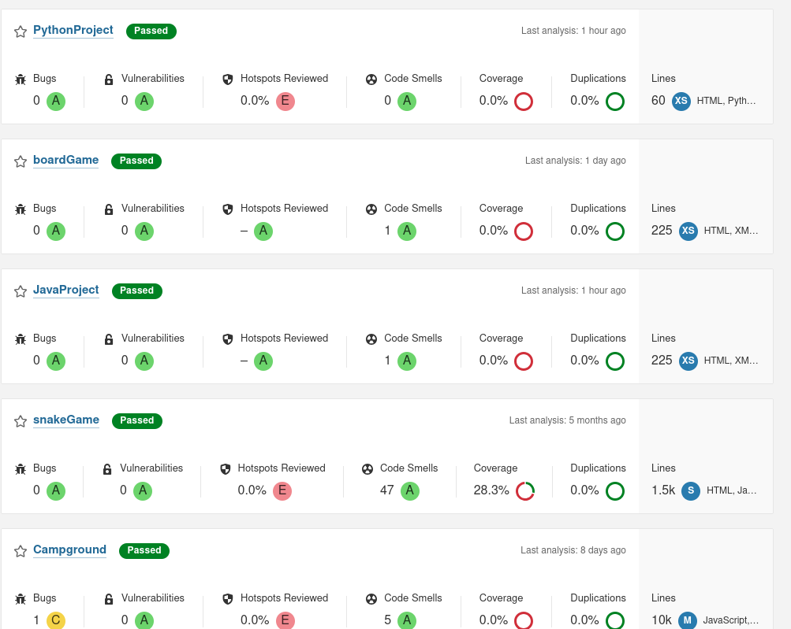
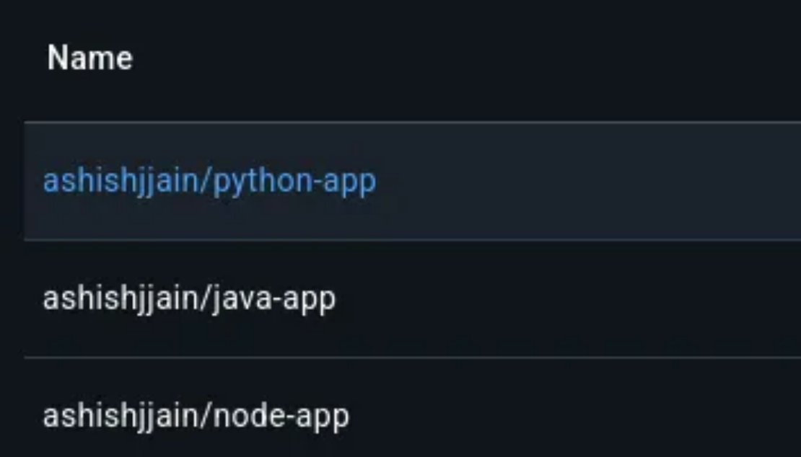
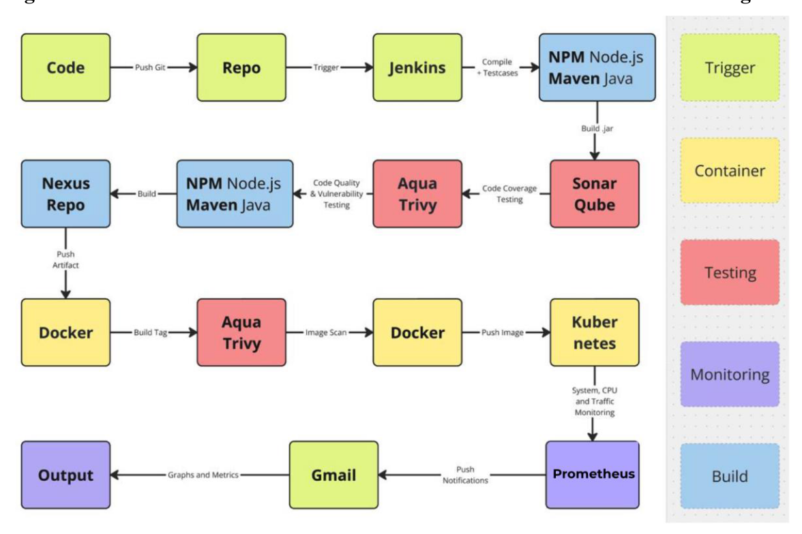
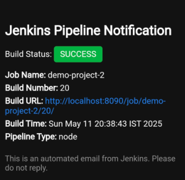
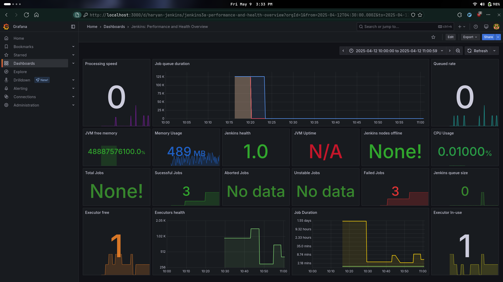
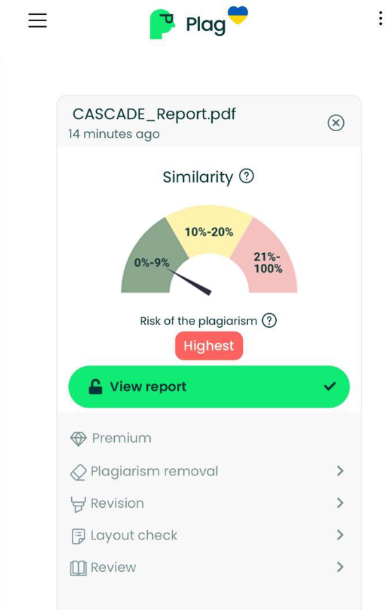

# CASCADE: A Scalable Open-Source CI/CD Pipeline

## 📌 Project Overview

**CASCADE** (Continuous Automation System for Code Analysis, Deployment & Evaluation) is an end-to-end CI/CD solution built entirely on **open-source technologies**. Designed to streamline the software delivery lifecycle, CASCADE integrates tools like **Jenkins**, **SonarQube**, **Docker**, **Kubernetes**, **Prometheus/Grafana**, and **Trivy** to offer a secure, efficient, and cost-effective development pipeline.

---

## 🚀 Features

- Fully automated CI/CD pipeline using Jenkins
- Static code analysis and quality gates with SonarQube
- Secure containerization with Trivy and Docker
- Scalable deployments on Kubernetes
- Real-time monitoring with Prometheus and Grafana
- Automated email notifications for build status
- Plagiarism detection integration for academic use cases
- Support for Java, Node.js, and Python applications

---

## 📂 Project Structure

```plaintext
├── Jenkinsfile                # Pipeline script
├── Dockerfile                # App containerization
├── requirements.txt / pom.xml / package.json
├── dashboards/               # Grafana JSON templates
├── reports/                  # Trivy & Sonar reports
├── screenshots/              # Screenshots for documentation
└── src/                      # Source code
```

---

## 🛠️ Tools & Technologies

| Tool          | Purpose                          |
|---------------|----------------------------------|
| Jenkins       | CI/CD Orchestration              |
| SonarQube     | Static Code Analysis             |
| Trivy         | Vulnerability Scanner            |
| Docker        | Containerization                 |
| Kubernetes    | Deployment & Scaling             |
| Prometheus    | Metrics Collection               |
| Grafana       | Monitoring & Dashboarding        |
| GitHub        | Source Control                   |
| Gmail         | Email Notifications              |

---

## 📸 Screenshots & Visuals

> ⚠️ Replace the placeholders below with actual image links or file paths.

### 1. Jenkins Pipeline Execution  


### 2. SonarQube Code Quality Report  


### 3. Docker Images Built & Tagged  


### 4. Complete Pipeline Workflow  


### 5. Email Notification (Success/Failure Alert)  


### 6. Grafana Dashboard for Monitoring  


### 7. Trivy + Sonar + Scripted Plagiarism Report  


---
## 🔁 Workflow Overview

```mermaid
graph LR
A[Code Commit] --> B[Jenkins Build Trigger]
B --> C{Project Type}
C -->|Node| D1[NPM Install + Test]
C -->|Java| D2[Maven Build + Test]
C -->|Python| D3[Pip Install + Pytest]

D1 --> E[Trivy Scan + SonarQube]
D2 --> E
D3 --> E

E --> F[Docker Build + Tag]
F --> G[Trivy Image Scan]
G --> H[Docker Push]

H --> I[Kubernetes Deployment]
I --> J[Monitoring (Grafana & Prometheus)]
J --> K[Email Notification]
```


## 📧 Email Notifications

- Jenkins sends HTML-formatted emails on build success/failure.
- Includes job name, build number, status, timestamp, and clickable build link.
- Configured using the `emailext` plugin and Gmail SMTP.

---

## 🔒 Security Considerations

- 🔐 **Token-based access** for GitHub, Docker, and SonarQube
- 🔐 **TLS encryption** for data-in-transit
- 🔐 **Role-based access control (RBAC)** in Kubernetes
- 🔐 **Secret scanning** using Trivy

---

## 📈 Monitoring and Logging

- 📊 **Grafana Dashboards** visualize real-time CPU, memory, disk, and traffic metrics.
- 🔎 **Prometheus** scrapes metrics from running services.
- 🔍 **Blackbox Exporter** ensures service uptime and endpoint health.
- 📦 (Optional) Integration with ELK Stack for log aggregation.

---

## 🧪 Test Automation

- Unit tests included for Java, Node.js, and Python projects
- Tests integrated within pipeline stages
- Coverage reports managed via SonarQube

---

## 🧠 Intelligent Features

- 🚨 Vulnerability alerts via Trivy (FS and image scans)
- ✅ Quality gate enforcement using SonarQube
- 📩 Automated Slack/email reports for builds and scans
- 🔁 Smart pipeline branching based on detected tech stack (Node, Java, Python)

---

## 📜 Plagiarism Reporting (Academic Context)

- Java-based detection integrated
- Scans LDAP scripts and unit tests for duplication
- Generates HTML report using diff tools or third-party analyzers

---

## 💻 Project Compatibility

- ✅ Java 11 (Maven)
- ✅ Node.js 18
- ✅ Python 2.7 & 3.x
- 🐳 Compatible with Docker and K8s clusters
- 🌐 GitHub for version control

---

## 🗃️ Future Enhancements

- Integrate GitOps (e.g., ArgoCD or FluxCD)
- Add AI-based test case generation
- Enhance RBAC for multi-tenant environments
- Connect ELK for full observability

---

## 🧑‍💻 Author

**Ashish Jain**  
Email: [ashishxojain@gmail.com](mailto:ashishxojain@gmail.com)  
GitHub: [@ashishxojain](https://github.com/ashishxojain)

---

## 📄 License

This project is licensed under the [MIT License](LICENSE).

---

## 🙏 Acknowledgements

- Open Source Communities
- Jenkins, SonarQube, Docker, Kubernetes, and Prometheus contributors
- Academic mentors and peer collaborators
